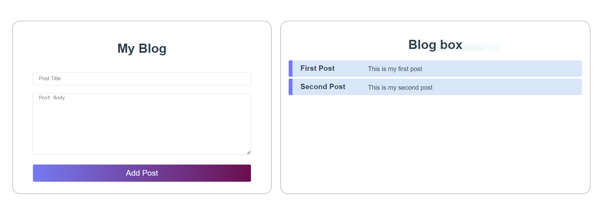

Islam Gaber © www.linkedin.com/in/islam-gaber-10a21b244
<div align="center">
  <a href="https://github.com/othneildrew/Best-README-Template">
    
  </a>
 </div>
# blogging

## Project setup
```
npm install
```

### Compiles and hot-reloads for development
```
npm run serve
```

### Compiles and minifies for production
```
npm run build
```

### Lints and fixes files
```
npm run lint
```

### Customize configuration
See [Configuration Reference](https://cli.vuejs.org/config/).
